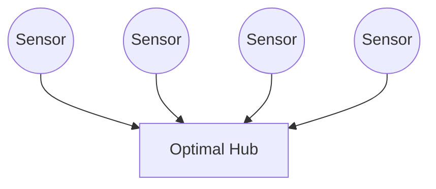
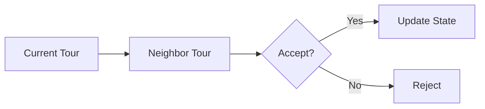
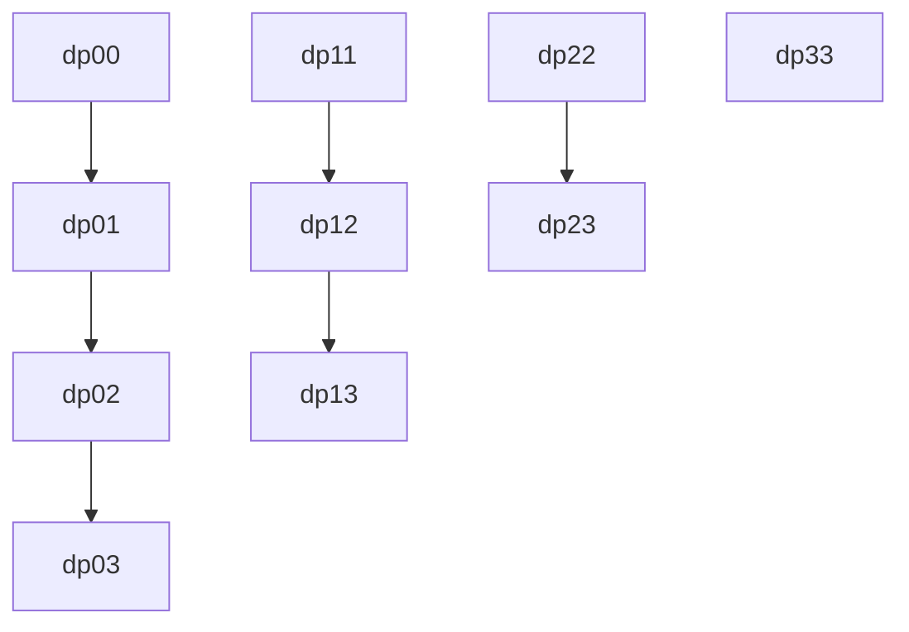
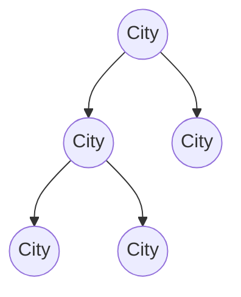
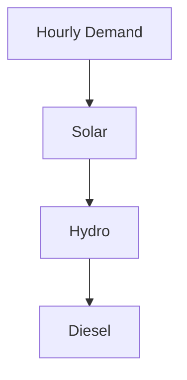
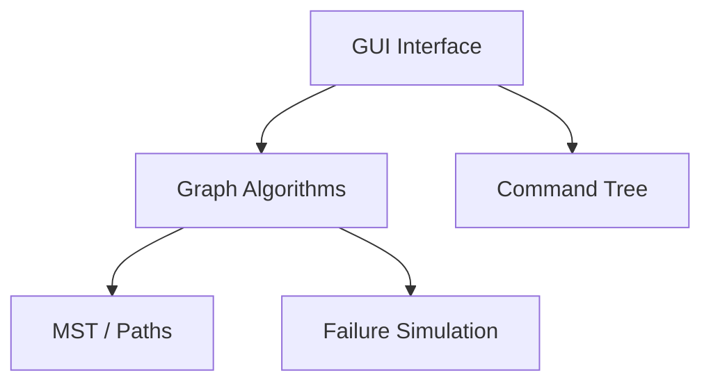
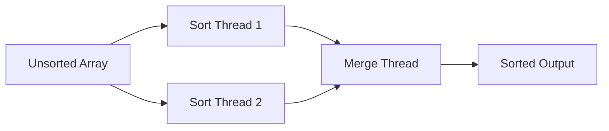
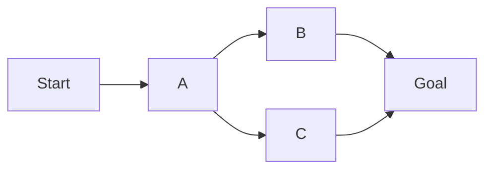
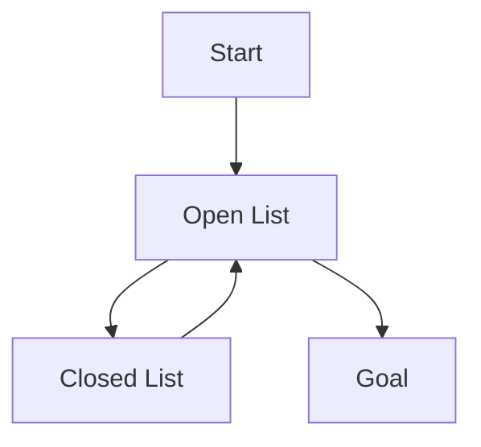

# 🚀 Advanced Algorithms Coursework

**Module:** ST5003CEM – Advanced Algorithms
**Student:** Mandish Sen
**Institution:** Softwarica College of IT & E-Commerce (Coventry University)
**Language:** Python
**Focus:** Algorithm Design · Optimization · Correctness · Real-World Modeling

---

## 🧠 Design Philosophy

This coursework follows a structured algorithmic discipline:

> **Problem Modeling → Algorithm Selection → Proof of Correctness → Complexity Analysis → Trade-off Discussion**

Each solution is:

* Algorithmically efficient
* Scalable
* Defensible in examination
* Mapped to real-world systems

---

# 📌 QUESTION 1(a)

## Optimizing Sensor Placement (Geometric Optimization)

### Problem

Find a hub position minimizing total Euclidean distance to all sensors.

### Algorithm

**Geometric Median Optimization** minimizes the sum of distances, unlike the centroid which minimizes squared distances.

### Diagram

### Correctness

* Objective is convex → global minimum guaranteed

### Complexity

* Time: Iterative convergence
* Space: O(1)

---

# 📌 QUESTION 1(b)

## Traveling Salesperson Problem (Simulated Annealing)

### Reasoning

TSP is NP-Hard → exact solutions do not scale. Simulated Annealing allows:

* Controlled randomness
* Escaping local minima
* Near-optimal solutions

### State Transition

### Complexity

* Time: O(iterations × N)
* Space: O(N)

---

# 📌 QUESTION 2

## Strategic Tile Shatter (Dynamic Programming)

### Insight

Equivalent to **Burst Balloons** problem. Choose the **last tile to shatter** for optimal substructure.

### DP Table Growth

### Complexity

* Time: O(n³)
* Space: O(n²)

---

# 📌 QUESTION 3

## Minimum Service Centers in a Tree

### Problem Type

Tree coverage optimization using DFS.

### Node States

* Needs coverage
* Covered
* Has service center

### Tree Example

### Complexity

* Time: O(n)
* Space: O(height)

---

# 📌 QUESTION 4

## Smart Energy Grid Load Optimization (Nepal)

### Real-World Model

Energy sources:

* Solar (cheap, limited hours)
* Hydro (moderate, always available)
* Diesel (expensive, fallback)

### Algorithm

* Dynamic Programming across hours
* Greedy allocation within each hour

### Allocation Flow

### Objectives

* Minimize cost
* Maximize renewables
* Reduce diesel usage
* Allow ±10% flexibility

### Complexity

* Time: O(H × S × D)
* Space: O(H)

---

# 📌 QUESTION 5(a)

## Interactive Emergency Network Simulator (GUI)

### System Components

* Graph-based city network
* Tree-based command hierarchy
* Real-time algorithm visualization

### System Architecture

### Algorithms Used

* Kruskal / Prim (MST)
* BFS / DFS / A*
* Tree Rebalancing
* Rerouting after failures

---

# 📌 QUESTION 5(b)

## Multithreaded Sorting Application

### Thread Architecture

### Key Concepts

* Shared memory
* Thread synchronization
* Race-free design

### Complexity

* Sorting: O(n log n)
* Merge: O(n)

---

# 📌 QUESTION 6

## Robot Navigation & Search Algorithms

### State Space Model

### DFS vs BFS

| Algorithm | Strength      | Weakness    |
| --------- | ------------- | ----------- |
| DFS       | Low memory    | Not optimal |
| BFS       | Shortest path | High memory |

### A* Search

**Heuristic:** Straight-line (Euclidean) distance to goal

**Advantage:** Optimal + efficient when heuristic is admissible

---

## 🎓 Takeaway

Each problem is solved by identifying its computational structure and applying the most appropriate algorithmic paradigm, supported by correctness arguments and complexity analysis.

---

## ✅ Repository Highlights

* Advanced algorithmic thinking
* Strong modeling skills
* Real-world system optimization
* Clear, examination-ready explanations
* Professional presentation

Do you want me to   `
